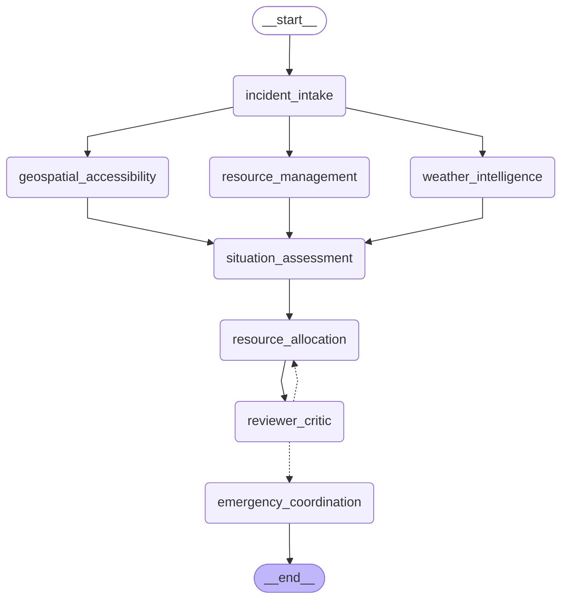

# Agent workflow (generated by `python -m app.graph.workflow --mermaid`)

```mermaid
---
config:
  flowchart:
    curve: linear
---
graph TD;
	__start__([<p>__start__</p>]):::first
	incident_intake(incident_intake)
	weather_intelligence(weather_intelligence)
	geospatial_accessibility(geospatial_accessibility)
	resource_management(resource_management)
	situation_assessment(situation_assessment)
	resource_allocation(resource_allocation)
	reviewer_critic(reviewer_critic)
	emergency_coordination(emergency_coordination)
	__end__([<p>__end__</p>]):::last
	__start__ --> incident_intake;
	geospatial_accessibility --> situation_assessment;
	incident_intake --> geospatial_accessibility;
	incident_intake --> resource_management;
	incident_intake --> weather_intelligence;
	resource_allocation --> reviewer_critic;
	resource_management --> situation_assessment;
	reviewer_critic -.-> emergency_coordination;
	reviewer_critic -.-> resource_allocation;
	situation_assessment --> resource_allocation;
	weather_intelligence --> situation_assessment;
	emergency_coordination --> __end__;
	classDef default fill:#f2f0ff,line-height:1.2
	classDef first fill-opacity:0
	classDef last fill:#bfb6fc
```
